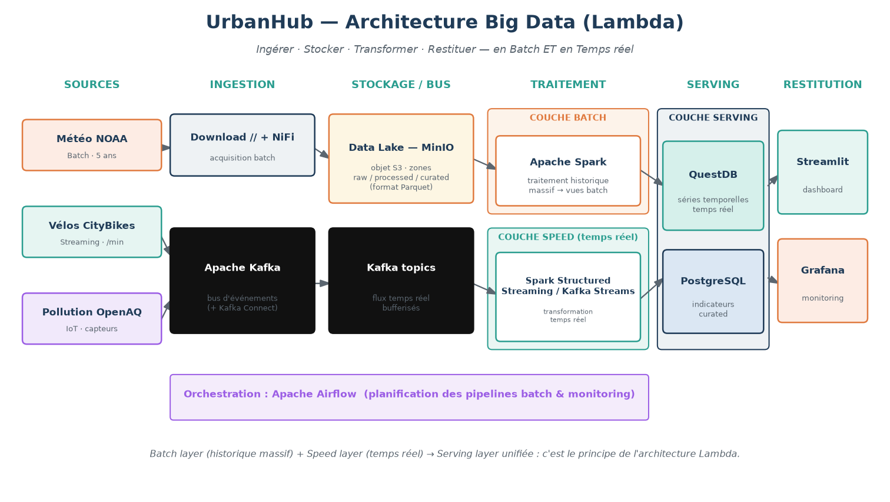

**Équipe : AIT TAYEB LYES · DZIRI RAYANE · HAMMA SOFIANE · LEKOUARA ABDELRAFIK**

> 📦 **À rendre au prof ? → voir [`LIVRABLES.md`](LIVRABLES.md)** (lien GitHub, recording, veille — tout au même endroit).

# UrbanHub — Jumeau numérique urbain (Smart City Data Platform)

UrbanHub est une plateforme de **data engineering** qui ingère, stocke, traite et
analyse en continu les données d'une ville moderne. Elle combine **trois types de
flux Big Data** typiques d'une Smart City :

| Flux | Type | Source | Fréquence |
|------|------|--------|-----------|
| **Batch** | Données historiques massives | [NOAA Global Hourly Weather](https://www.ncei.noaa.gov/data/global-hourly/access/) | Les 5 dernières années |
| **Streaming** | Temps réel | [CityBikes API](https://api.citybik.es/v2/) (vélos en libre-service) | Toutes les minutes |
| **IoT** | Capteurs | [OpenAQ API](https://api.openaq.org/) (pollution atmosphérique) | Ingestion régulière |

## Architecture

```
Sources de données  (NOAA / CityBikes / OpenAQ)
        │
        ▼
Ingestion            urbanhub/ingestion/   (API / download parallèle / scraping)
        │
        ▼
Stockage Data Lake   data/raw/             (zone brute, immuable, partitionnée par date)
        │
        ▼
Traitement           urbanhub/processing/  → data/processed/  (Parquet nettoyé)
        │
        ▼
Analyse Data / IA    urbanhub/analysis/    (corrélations, anomalies, indices)
        │
        ▼
Indicateurs urbains  data/curated/         (JSON / CSV / graphiques)
```

### Organisation du data lake

```
data/
├── raw/                        # Zone BRUTE (non versionnée, volumineuse)
│   ├── batch/weather/year=YYYY/<station>.csv
│   ├── streaming/citybikes/year=/month=/day=/snapshot_*.jsonl
│   └── iot/openaq/year=/month=/day=/openaq_*.jsonl
├── processed/                  # Zone NETTOYÉE (Parquet, non versionnée)
│   ├── weather/weather_hourly.parquet
│   ├── citybikes/citybikes.parquet
│   └── openaq/pollution.parquet
└── curated/                    # Zone INDICATEURS (versionnée dans le repo)
    ├── indicators/*.json / *.csv
    └── reports/*.png
```

Le partitionnement par date (`year=/month=/day=`) suit la convention Hive,
standard des data lakes, et permet un traitement incrémental efficace.

## Architecture Big Data (Lambda)

Au-delà du prototype (Python/pandas), UrbanHub est pensé comme une **plateforme
Big Data** capable d'**ingérer, stocker, transformer et restituer** des données à
grande échelle, **en batch et en temps réel** (architecture **Lambda**). Le
document [`docs/ARCHITECTURE_BIGDATA.md`](docs/ARCHITECTURE_BIGDATA.md) détaille
les couches (Batch / Speed / Serving), les technologies open source retenues
(Kafka, MinIO, Spark, QuestDB, Streamlit/Grafana, Airflow) et **justifie chaque
choix face à ses concurrentes**.



## Installation

```bash
pip install -r requirements.txt
```

Dépendances : `pandas`, `numpy`, `pyarrow`, `requests`, `matplotlib`.

## Utilisation

Chaque flux dispose d'une commande dédiée via l'interface CLI :

```bash
# Initialiser l'arborescence du data lake
python -m urbanhub.cli init

# Flux BATCH : téléchargement parallèle de la météo NOAA (France, 5 ans)
python -m urbanhub.cli batch --years 5
python -m urbanhub.cli batch --years 2 --max-stations 20   # run rapide

# Flux STREAMING : collecte des vélos toutes les minutes
python -m urbanhub.cli stream --iterations 60 --interval 60

# Flux IoT : ingestion pollution (réel si clé API, sinon simulé)
python -m urbanhub.cli iot --iterations 12 --interval 300
python -m urbanhub.cli iot --backfill-hours 72             # historique diurne simulé

# Traitement (nettoyage / normalisation) + Analyse (indicateurs)
python -m urbanhub.cli process
python -m urbanhub.cli analyze

# Chaîne complète de démonstration (périmètre réduit, exécution rapide)
python -m urbanhub.cli pipeline --demo

# Tableau de bord interactif (après avoir généré les indicateurs)
python -m urbanhub.cli dashboard          # ouvre http://localhost:8501
# équivalent : streamlit run urbanhub/dashboard/app.py

# Présentation PowerPoint de soutenance (.pptx)
python -m urbanhub.cli slides             # -> data/curated/reports/UrbanHub_presentation.pptx

# Document Word des réponses aux questions métier (.docx + .md)
python -m urbanhub.cli doc                # -> data/curated/reports/UrbanHub_reponses_questions_metier.docx
```

### Présentation (PowerPoint)

La commande `slides` génère automatiquement une présentation `.pptx` (10
diapositives, format 16:9) à partir des **indicateurs réels** du data lake et des
graphiques générés : contexte, architecture, chiffres clés, une diapositive par
flux (Batch / Streaming / IoT), analyse croisée, tableau de bord et conclusion.
Le fichier est écrit dans `data/curated/reports/UrbanHub_presentation.pptx`.

### Tableau de bord (Streamlit)

Un **tableau de bord interactif** visualise les résultats du data lake, organisé
en 4 onglets — **Météo (Batch)**, **Mobilité (Streaming)**, **Pollution (IoT)** et
**Analyse croisée** — avec KPIs, **carte des stations vélos**, classements,
profils horaires, matrice de corrélation météo/pollution et graphiques.

```bash
pip install -r requirements.txt          # inclut streamlit
python -m urbanhub.cli pipeline --demo --iot-backfill 72   # générer les données
python -m urbanhub.cli dashboard          # lancer le tableau de bord
```

Le tableau de bord lit `data/curated/` et `data/processed/` ; il affiche un
message d'aide si le pipeline n'a pas encore été exécuté.

### Clé API OpenAQ

L'API OpenAQ v3 nécessite une clé (en-tête `X-API-Key`). Fournissez-la via une
variable d'environnement :

```bash
export OPENAQ_API_KEY="votre_cle"
python -m urbanhub.cli iot --iterations 12 --interval 300 --real
```

En l'absence de clé, la plateforme **bascule automatiquement en mode simulé**
(`source = "simulated"`) afin que toute la chaîne reste démontrable de bout en
bout. La simulation reproduit des cycles réalistes (pics de NO₂ aux heures de
pointe, pic d'ozone l'après-midi, niveaux de fond plus élevés dans les grandes
villes). C'est cohérent avec la consigne « ingestion régulière **simulant** un
flux IoT ».

---

## Partie 1 — Flux Batch : analyse météorologique urbaine

**Ingestion** (`urbanhub/ingestion/batch_weather.py`) :
1. Récupération du référentiel `isd-history.csv` (~380 stations françaises).
2. Filtrage des stations `CTRY == FR` actives sur les 5 dernières années.
3. **Téléchargement parallèle** (`ThreadPoolExecutor`, 12 threads) des fichiers
   `<station>.csv` — jamais un par un.

**Nettoyage** (`urbanhub/processing/weather.py`) : le format ISD encode plusieurs
variables dans des champs composites. On extrait et convertit :

| Variable | Champ ISD | Traitement |
|----------|-----------|------------|
| Température (°C) | `TMP` | ÷10, sentinelle `+9999` → NaN |
| Point de rosée (°C) | `DEW` | ÷10 |
| Pression (hPa) | `SLP` | ÷10, sentinelle `99999` |
| Visibilité (m) | `VIS` | sentinelle `999999` |
| Vent (dir° / m/s) | `WND` | vitesse ÷10 |
| Précipitations (mm) | `AA1` | ÷10 |
| Humidité relative (%) | dérivée | formule de Magnus (T, T_rosée) |

Filtres de plausibilité (T ∈ [−40, 55] °C), déduplication, normalisation du
timestamp en UTC, rattachement de chaque station à la principale ville française
la plus proche (< 40 km) et calcul de la saison.

### Réponses aux questions métier (`data/curated/indicators/weather_indicators.json`)

- **Périodes météo anormales ?** Oui — détectées via le **z-score** de la
  température journalière vs la normale mensuelle (seuil |z| ≥ 2.5). Ex. sur les
  données de démo, le 1ᵉʳ juillet 2025 ressort comme anomalie chaude (z ≈ 3.5).
- **Corrélation météo / visibilité ?** Oui — la visibilité est surtout
  **négativement corrélée à l'humidité** (≈ −0.64, brouillard) et positivement à
  la température (≈ +0.37).
- **Évolution saisonnière de la température ?** Fournie pour la France et par
  ville (Hiver ≈ 4 °C, Printemps ≈ 12 °C, Été ≈ 19 °C sur l'échantillon).
  Voir `reports/weather_saisonnier.png`.
- **Jours extrêmes ?** Jour le plus chaud / froid / pluvieux / venté identifiés
  avec leurs valeurs. Voir `reports/weather_anomalies.png`.

---

## Partie 2 — Flux Streaming : mobilité urbaine

**Ingestion** (`urbanhub/ingestion/streaming_citybikes.py`) : système de
récupération automatique (par défaut **toutes les minutes**) de l'état des
stations de tous les réseaux de vélos en libre-service **de France** (~66
réseaux, dont Vélib' à Paris — soit ~5 600 stations). Variables extraites par
station : `station_id`, `station_name`, `latitude`, `longitude`,
`bikes_available`, `free_slots`, `timestamp`.

**Traitement** (`urbanhub/processing/citybikes.py`) : typage, calcul de la
`capacity`, du `occupancy_rate` (taux d'occupation), des indicateurs `is_empty` /
`is_full`.

### Réponses aux questions métier (`mobility_indicators.json`)

- **Stations les plus utilisées ?** Classement par taux d'occupation moyen.
- **Zones à offre insuffisante ?** Stations le plus souvent **vides**
  (`pct_empty` élevé).
- **Pics d'utilisation journaliers ?** Profil horaire de disponibilité
  (`reports/mobility_profil_horaire.png`) — se remplit à mesure que le flux
  tourne sur la journée.
- **Déséquilibres géographiques ?** Agrégation par ville (occupation moyenne,
  % vides / pleines).
- **Stations critiques à rééquilibrer ?** Détection des stations en pénurie
  (souvent vides) **ou** en saturation (souvent pleines), `criticité ≥ 0.5`.

---

## Partie 3 — Flux IoT : pollution urbaine

**Ingestion** (`urbanhub/ingestion/iot_openaq.py`) : ingestion régulière
simulant un flux IoT pour les principales villes françaises. Polluants suivis :
**PM2.5, PM10, NO₂, O₃, SO₂, CO**. Mode réel (OpenAQ v3) si `OPENAQ_API_KEY`
est défini, sinon **simulateur** réaliste (cycles diurnes). Une fonction
`backfill` génère un historique (ex. 72 h) pour alimenter les analyses
temporelles.

### Réponses aux questions métier (`pollution_indicators.json`)

- **Villes les plus polluées** par polluant (moyenne par ville).
- **Profil horaire** de chaque polluant (pics de trafic NO₂, pic d'ozone).
- **Dépassements de seuils** (référentiel OMS indicatif) : comptage par
  ville/polluant.
- **Indice de qualité de l'air** par ville = moyenne des ratios `valeur/seuil`
  (classement, `reports/pollution_classement_villes.png`).

---

## Partie 4 — Analyse croisée des données

**`urbanhub/analysis/cross_analysis.py`** — Les trois flux n'ayant pas la même
profondeur temporelle (météo = historique batch pluriannuel ; vélos & pollution =
temps réel), le croisement sur l'horodatage exact serait quasi vide. La
plateforme croise donc sur le **cycle diurne** (heure de la journée 0–23) : chaque
flux est réduit à son **profil journalier typique**, ce qui est robuste et
physiquement pertinent (cycles jour/nuit, pointes de trafic, photochimie).

### Réponses aux questions métier (`cross_indicators.json`)

- **Relation météo / pollution ?** Oui, nette. Sur les profils diurnes,
  l'**ozone est fortement corrélé à la température** (≈ +0.93) et négativement à
  l'humidité (≈ −0.95) — signature de la formation photochimique de l'O₃.
- **La météo influence-t-elle l'usage des vélos ?** Le mécanisme de corrélation
  (température, pluie, vent, visibilité vs vélos disponibles) est en place ;
  il devient significatif lorsque le flux streaming a tourné sur l'ensemble de
  la journée (voir note ci-dessous).
- **Conditions favorables à la mobilité douce ?** Définies comme T ∈ [12, 25] °C,
  pas de pluie, vent < 6 m/s. La part d'heures favorables est calculée globalement
  et **par saison** (bien plus élevée en été qu'en hiver).
- **Interactions fortes météo × pollution × mobilité ?** Profil diurne conjoint
  des trois flux (`reports/cross_cycle_diurne.png`).

> **Note d'ingénierie.** Les analyses temps réel (mobilité) gagnent en
> profondeur à mesure que les flux `stream` / `iot` tournent (par ex. via un cron
> `* * * * *` pour les vélos). En démonstration, la météo (batch) et la pollution
> (backfill 72 h) couvrent les 24 heures, tandis que la mobilité ne couvre que la
> fenêtre réellement collectée — la plateforme le signale explicitement au lieu
> d'extrapoler.

---

## Livrables

| Livrable attendu | Emplacement |
|------------------|-------------|
| Scripts de collecte | `urbanhub/ingestion/` |
| Stockage structuré | `data/` (data lake raw / processed / curated) |
| Traitement data engineering | `urbanhub/processing/` |
| Analyse data / IA | `urbanhub/analysis/` |
| Indicateurs urbains | `data/curated/indicators/` + `data/curated/reports/` |
| Tableau de bord | `urbanhub/dashboard/app.py` (Streamlit) |
| Présentation | `data/curated/reports/UrbanHub_presentation.pptx` (via `urbanhub/presentation.py`) |
| Réponses aux questions métier | `docs/REPONSES_QUESTIONS_METIER.md` + `.docx` (via `urbanhub/report_doc.py`) |
| **Architecture Big Data (Lambda) + justification des choix** | `docs/ARCHITECTURE_BIGDATA.md` (schéma via `urbanhub/architecture_diagram.py`) |
| Orchestration | `urbanhub/cli.py` |

## Structure du projet

```
urbanhub/
├── config.py                 # data lake, villes FR, paramètres des 3 sources
├── cli.py                    # orchestrateur (init/batch/stream/iot/process/analyze/pipeline)
├── utils/                    # logging + couche d'accès data lake (parquet/jsonl/json)
├── ingestion/                # batch_weather / streaming_citybikes / iot_openaq
├── processing/               # weather / citybikes / openaq (nettoyage → Parquet)
├── analysis/                 # weather / mobility / pollution / cross (indicateurs)
└── dashboard/app.py          # tableau de bord interactif Streamlit
```

## Reproduire la démo

```bash
pip install -r requirements.txt
python -m urbanhub.cli pipeline --demo --iot-backfill 72
```

Les indicateurs et graphiques versionnés dans `data/curated/` proviennent d'une
exécution réelle de cette commande.
