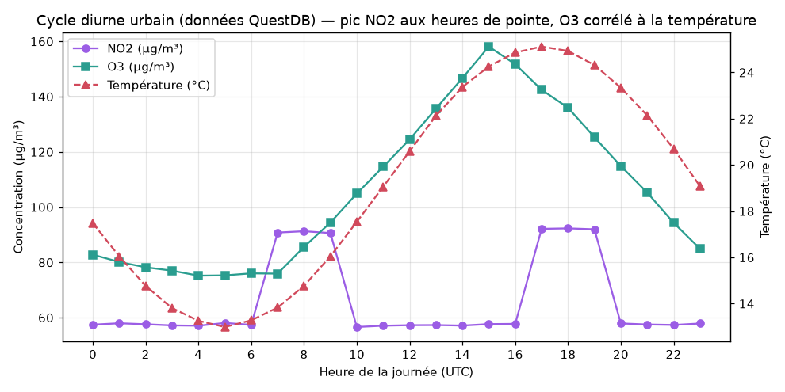

# Veille technologique Big Data — **QuestDB**

> Document de synthèse — projet « Présenter une techno pour un Meetup ».
> Outil open source étudié : **QuestDB**, base de données time-series haute performance.

---

## 0. Pourquoi ce choix ?

Le paysage Big Data est immense et fragmenté (cf. *Data & AI Landscape*). Dans le
cadre de notre projet **UrbanHub** — un jumeau numérique urbain qui ingère de la
météo, de la mobilité et de la pollution — nous manipulons essentiellement des
**séries temporelles** : des mesures horodatées, produites en continu par des
capteurs et des API. C'est exactement le terrain de jeu des **bases time-series**.

Nous avons choisi **QuestDB** parce que :
- c'est un outil **récent** (première version publique en 2019-2020) et encore peu
  utilisé autour de nous — l'objectif d'une veille ;
- il est **spécialisé IoT / séries temporelles**, donc parfaitement aligné avec
  UrbanHub ;
- il est **open source** (licence Apache 2.0) ;
- il combine une **ingestion très rapide** (streaming) et des **requêtes SQL**
  analytiques — il peut donc jouer à la fois la **couche Speed** et la **couche
  Serving** d'une architecture Big Data.

---

## 1. Qu'est-ce que QuestDB ?

QuestDB est une **base de données relationnelle orientée séries temporelles**,
écrite en **Java/C++**, conçue pour ingérer des millions d'événements par seconde
et les interroger en **SQL**. Son modèle de stockage est **en colonnes**, les
données sont **partitionnées par temps** (jour, mois, année) et physiquement
**triées par horodatage**, ce qui rend les requêtes sur des plages de temps
extrêmement rapides.

Trois idées clés :
1. **SQL d'abord** : on écrit du SQL standard, enrichi d'extensions temporelles
   (`SAMPLE BY`, `LATEST ON`, `ASOF JOIN`, `FILL`).
2. **Ingestion multi-protocoles** : ILP (InfluxDB Line Protocol) pour le débit,
   PostgreSQL wire pour la compatibilité, REST/CSV pour l'import.
3. **Zéro dépendance** : un seul binaire/conteneur, pas de cluster ZooKeeper ni
   de composants annexes à opérer.

---

## 2. Cas d'usage les plus adaptés

QuestDB est **indispensable** (ou au moins excellent) quand :

| Cas d'usage | Pourquoi QuestDB |
|-------------|------------------|
| **IoT / capteurs** (pollution, énergie, industrie) | Ingestion massive horodatée + requêtes de fenêtrage |
| **Monitoring / observabilité** (métriques infra) | `SAMPLE BY` + `LATEST ON` pour dashboards temps réel |
| **Finance / marchés** (ticks, order books) | `ASOF JOIN` pour aligner des flux à des instants proches |
| **Véhicules connectés, télémétrie** | Débit d'écriture élevé, faible latence de lecture |
| **Smart City (UrbanHub)** | Météo + pollution + mobilité = 3 flux time-series à corréler |

À l'inverse, QuestDB **n'est pas** le bon outil pour : des données fortement
relationnelles avec beaucoup de jointures transactionnelles, des mises à jour
ligne à ligne fréquentes, ou un usage OLTP classique (là, PostgreSQL reste roi).

---

## 3. Architecture et fonctionnement

```
        Producteurs (capteurs, API, apps)
                     │
     ┌───────────────┼───────────────────┐
     │ ILP (9009)    │ PG wire (8812)     │ REST/CSV (9000)
     ▼               ▼                    ▼
┌─────────────────────────────────────────────────┐
│                    QuestDB                        │
│  ┌───────────┐   ┌──────────────┐  ┌───────────┐ │
│  │ WAL (write │──▶│ Moteur colonne│─▶│  SQL /    │ │
│  │  ahead log)│   │ partitionné /  │  │  console  │ │
│  └───────────┘   │  trié par temps│  └───────────┘ │
│                  └──────────────┘                  │
└─────────────────────────────────────────────────┘
                     │
              Stockage disque (colonnes + partitions par jour)
```

- **WAL (Write-Ahead Log)** : les écritures sont d'abord journalisées, ce qui
  permet une ingestion concurrente et durable, puis appliquées à la table.
- **Stockage colonne** : chaque colonne est un fichier ; on ne lit que les
  colonnes utiles à la requête.
- **Partitionnement temporel** : les données sont rangées par jour/mois → une
  requête sur « les 7 derniers jours » ne scanne que 7 partitions.
- **Type `SYMBOL`** : chaînes « internées » (dictionnaire d'entiers) pour les
  colonnes répétitives (ville, capteur…) → gros gain mémoire et vitesse.
- **`timestamp` désigné** : une colonne temporelle spéciale qui garantit l'ordre
  et active les fonctions temporelles.

---

## 4. Prise en main (install, lancement, CLI, UI)

### 4.1 Lancement le plus simple — Docker

```bash
docker run -d --name questdb \
  -p 9000:9000 -p 8812:8812 -p 9009:9009 \
  questdb/questdb:8.2.1
```

- **9000** : console web + API REST
- **8812** : protocole PostgreSQL wire
- **9009** : ILP (ingestion haute performance)

Un fichier `docker-compose.yml` prêt à l'emploi est fourni dans `docker/`.

### 4.2 L'interface web (UI)

QuestDB embarque une **console web** sur `http://localhost:9000` : éditeur SQL,
visualisation des résultats, import de CSV par glisser-déposer, et suivi des
tables. C'est l'un de ses gros atouts pédagogiques : aucune installation de client.

### 4.3 Administration en CLI / SQL

Tout s'administre en **SQL** (via `psql`, la console, ou l'API REST) :

```sql
-- Création d'une table time-series (timestamp désigné, partition par jour, WAL)
CREATE TABLE air_quality (
  ts TIMESTAMP, city SYMBOL, pollutant SYMBOL, value DOUBLE
) TIMESTAMP(ts) PARTITION BY DAY WAL;

-- Administration
SHOW TABLES;
ALTER TABLE air_quality ALTER COLUMN city ADD INDEX;
```

Connexion en ligne de commande via le protocole PostgreSQL :

```bash
psql -h localhost -p 8812 -U admin -d qdb   # mot de passe : quest
```

### 4.4 Acquisition des données (ingestion)

**a) ILP — le plus rapide** (utilisé dans notre démo, port 9009) :

```python
from questdb.ingress import Sender, TimestampNanos
with Sender.from_conf("tcp::addr=localhost:9009;") as s:
    s.row("air_quality",
          symbols={"city": "Paris", "pollutant": "no2"},
          columns={"value": 42.5},
          at=TimestampNanos.now())
    s.flush()
```

**b) SQL `INSERT`** (via PG wire ou REST) pour de petits volumes.

**c) Import CSV** via l'API REST `/imp` ou par glisser-déposer dans la console.

### 4.5 Traitement / requêtes (les extensions temporelles)

```sql
-- Moyenne journalière (bucketisation native)
SELECT ts, avg(value) FROM air_quality
WHERE pollutant='pm25' SAMPLE BY 1d;

-- Dernier état de chaque capteur (dashboard temps réel)
SELECT city, pollutant, value FROM air_quality
LATEST ON ts PARTITION BY city, pollutant;

-- Jointure temporelle : associer l'ozone à la température la plus proche
SELECT a.ts, a.value o3, w.temperature
FROM (air_quality WHERE pollutant='o3') a
ASOF JOIN weather w;
```

> Les **résultats réels** de ces requêtes sur nos données sont dans
> [`results/DEMO_OUTPUT.md`](../results/DEMO_OUTPUT.md).

---

## 5. Démonstration (résultats réels)

Nous avons chargé dans QuestDB des données urbaines simulées (pollution + météo
de 8 villes, 30 jours de mesures) via ILP, puis exécuté des requêtes temporelles.

- **Ingestion mesurée : ~57 600 lignes en ~0,1 s, soit ≈ 500 000 – 600 000
  lignes/seconde** sur une seule machine — c'est l'atout majeur de QuestDB.
- Requêtes `SAMPLE BY`, `LATEST ON`, `ASOF JOIN` exécutées en quelques
  millisecondes.

Le graphique ci-dessous, **produit à partir des données réellement stockées dans
QuestDB**, montre le cycle diurne : pic de NO₂ aux heures de pointe et ozone qui
suit la température (photochimie).



Pour reproduire : voir le dossier [`demo/`](../demo/).

---

## 6. Forces et faiblesses

### Forces
- **Ingestion extrêmement rapide** (ILP), pensée pour le streaming/IoT.
- **SQL familier** + extensions temporelles très expressives (`SAMPLE BY`,
  `ASOF JOIN`, `LATEST ON`).
- **Simplicité opérationnelle** : un seul binaire/conteneur, console web incluse.
- **Compatibilité PostgreSQL wire** → se branche sur les outils BI existants
  (Grafana, Superset, psql, JDBC).
- **Empreinte mémoire maîtrisée** grâce au type `SYMBOL` et au stockage colonne.

### Faiblesses
- **Pas fait pour l'OLTP** : peu adapté aux mises à jour/suppressions fréquentes
  ligne à ligne.
- **Scalabilité horizontale** : la réplication/clustering est plus récente et
  moins mature que des systèmes distribués comme Cassandra (l'usage typique
  reste « une grosse instance verticale »).
- **Écosystème plus jeune** que PostgreSQL ou InfluxDB (moins d'intégrations,
  communauté plus petite).
- **Jointures relationnelles complexes** moins riches qu'une base généraliste.

---

## 7. Comparaison avec les concurrents

| Critère | **QuestDB** | InfluxDB | TimescaleDB | ClickHouse | Cassandra |
|--------|-------------|----------|-------------|------------|-----------|
| Modèle | Time-series SQL | Time-series | Extension PostgreSQL | OLAP colonne | NoSQL colonnes larges |
| Langage | **SQL** + ext. | Flux/InfluxQL | SQL (PostgreSQL) | SQL (dialecte) | CQL |
| Ingestion | **Très élevée (ILP)** | Élevée | Moyenne/Élevée | Très élevée | Très élevée |
| Jointures temporelles | **`ASOF JOIN` natif** | Limité | Via SQL | Partiel | Non |
| Compat. PostgreSQL | **Oui (wire)** | Non | Oui (c'est PG) | Non | Non |
| Scalabilité horizontale | En progrès | Oui (entreprise) | Oui (multi-nœuds) | Excellente | **Excellente** |
| Simplicité d'exploitation | **Très simple** | Simple | Moyenne | Moyenne | Complexe |
| Idéal pour | IoT/monitoring/finance | Métriques | Séries + relationnel | Analytique massive | Écriture distribuée massive |

**En résumé :** face à **InfluxDB**, QuestDB gagne par le **vrai SQL** et la
compatibilité PostgreSQL. Face à **TimescaleDB**, il est plus rapide en ingestion
brute mais moins « relationnel complet ». Face à **ClickHouse**, il est plus
simple et plus « temps réel/série », ClickHouse restant plus fort sur l'analytique
distribuée massive. Face à **Cassandra**, QuestDB est bien plus simple à exploiter
et à requêter (SQL vs CQL), mais Cassandra reste imbattable pour l'écriture
massivement distribuée multi-datacenter.

---

## 8. Place dans une architecture Big Data (UrbanHub)

Dans une architecture de type **Lambda** (couche Batch / couche Speed / couche
Serving), QuestDB se positionne idéalement sur :

- **Couche Speed** : il ingère en continu les flux temps réel (capteurs de
  pollution, disponibilité des vélos) via ILP.
- **Couche Serving** : il répond en SQL, en quelques millisecondes, aux requêtes
  du tableau de bord (moyennes horaires, derniers états, corrélations).

**Pourquoi QuestDB et pas une autre techno ici ?** Parce que nos données sont
**intrinsèquement temporelles**, que nous voulons **du SQL** (pas un langage
propriétaire), une **ingestion streaming** simple, et un **déploiement léger** —
QuestDB coche ces quatre cases mieux que les alternatives pour notre cas d'usage.
La couche Batch (historique météo sur 5 ans) resterait, elle, sur un stockage de
type data lake + traitement Spark/pandas, QuestDB servant les résultats agrégés.

---

## 9. Déploiement Docker & Kubernetes

### Docker Compose
Fichier [`docker/docker-compose.yml`](../docker/docker-compose.yml) — volume
persistant, healthcheck, variables de configuration :

```bash
cd docker && docker compose up -d      # console : http://localhost:9000
```

### Kubernetes
Fichier [`k8s/questdb.yaml`](../k8s/questdb.yaml) — un **StatefulSet** (identité et
volume stables), un **Service headless**, une **ConfigMap** et un **Secret** :

```bash
kubectl apply -f k8s/questdb.yaml
kubectl -n bigdata port-forward svc/questdb 9000:9000 8812:8812 9009:9009
```

Le choix d'un **StatefulSet** (plutôt qu'un Deployment) est important : une base
de données a besoin d'un **stockage persistant stable** (`volumeClaimTemplates`)
et d'une identité réseau stable, ce que garantit le StatefulSet.

---

## 10. Conclusion

QuestDB est une base **time-series moderne, rapide et simple**, qui apporte le
confort du **SQL** au monde du streaming et de l'IoT. Pour un projet comme
UrbanHub, elle constitue une **couche Speed + Serving** idéale : ingestion
massive des capteurs et requêtes analytiques temps réel pour le tableau de bord.
Ses limites (OLTP, clustering encore jeune) la disqualifient pour certains usages,
mais sur son terrain — **les données horodatées à fort débit** — elle est
particulièrement pertinente et agréable à utiliser.

---

### Références
- Site officiel : https://questdb.io
- Documentation : https://questdb.io/docs/
- Dépôt GitHub : https://github.com/questdb/questdb
- Image Docker : https://hub.docker.com/r/questdb/questdb
